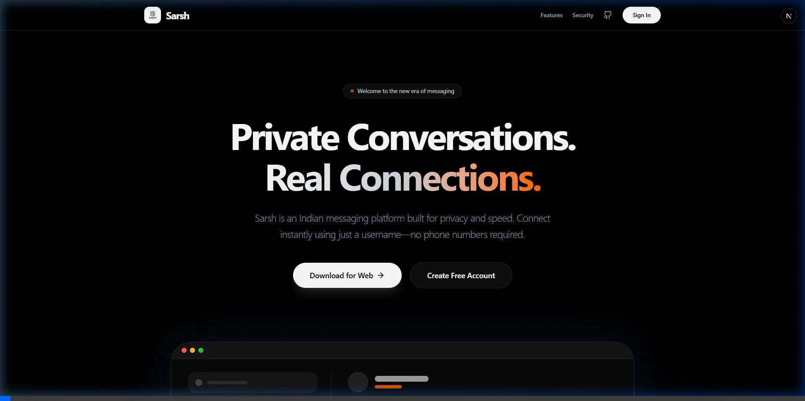

# Sarsh - Private Messaging Platform

Sarsh is a modern, privacy-focused messaging platform built for real connections.



## ✨ Features
- **Real-time Messaging**: Instant delivery via Socket.IO.
- **Privacy First**: Secure authentication and instant connectivity with a username.
- **Media Sharing**: Upload images, audio, and documents.
- **Theme Customization**: Beautiful dark and modern UI themes.
- **Cross-Platform**: Designed for a seamless web experience.

## 🚀 Quick Start

### Prerequisites
- Node.js & npm
- Docker (for PostgreSQL)

### Setup
1. **Database**: `docker-compose up -d`
2. **Install & Run**: 
   ```bash
   npm run install:all
   npm run dev
   ```

## 🛠️ Tech Stack
- **Frontend**: Next.js, Tailwind CSS
- **Backend**: Express.js, Socket.IO
- **Database**: PostgreSQL (Dockerized)
- **Media**: Cloudinary

---
"Private Conversations. Real Connections."

[View on GitHub](https://github.com/shashwatology/SarSh)